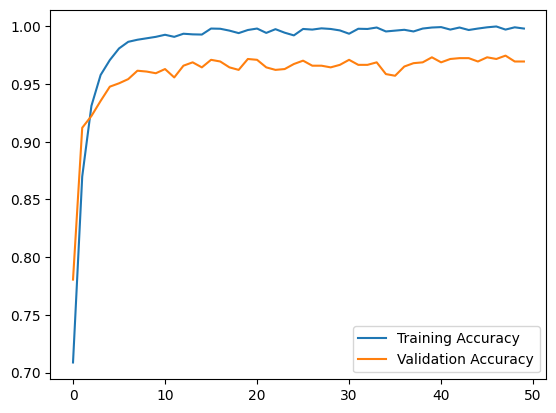

# Brain Tumour Detection CNN

A convolutional neural network (CNN) that classifies brain MRI scans into 4 categories with **97% validation accuracy**, built using Keras and TensorFlow.

> **Group project** — developed collaboratively by a 3-person team.

---

## Overview

Brain tumour detection from MRI scans is a challenging medical imaging task. This project builds and trains a CNN from scratch to classify MRI scans across 4 categories, demonstrating that a relatively lightweight architecture can achieve strong results on real medical imaging data.

### Classes
| Label | Description |
|-------|-------------|
| `glioma` | Glioma tumour |
| `meningioma` | Meningioma tumour |
| `pituitary` | Pituitary tumour |
| `healthy` | No tumour detected |

---

## Results

| Metric | Value |
|--------|-------|
| Best Validation Accuracy | **97.46%** (Epoch 48) |
| Final Validation Accuracy | 96.95% (Epoch 50) |
| Training Accuracy | ~99.8% |
| Epochs | 50 |
| Dataset Size | 6,900+ MRI images |

### Training Curves



The model converges quickly — reaching ~95% validation accuracy within the first 5 epochs — and plateaus steadily around 97%, with minimal overfitting thanks to dropout regularisation.

---

## Dataset

The dataset consists of **6,900+ brain MRI images** split across 4 classes:

| Class | Images |
|-------|--------|
| Healthy | 2,000+ |
| Glioma | 1,600+ |
| Meningioma | 1,600+ |
| Pituitary | 1,700+ |

Images are resized to **256×256 pixels** and normalised to the range [0, 1] via a `Rescaling` layer inside the model.

---

## Model Architecture

```
┏━━━━━━━━━━━━━━━━━━━━━━━━━━━━━━━━━┳━━━━━━━━━━━━━━━━━━━━━━━━┳━━━━━━━━━━━━━━━┓
┃ Layer (type)                    ┃ Output Shape           ┃     Param #   ┃
┡━━━━━━━━━━━━━━━━━━━━━━━━━━━━━━━━━╇━━━━━━━━━━━━━━━━━━━━━━━━╇━━━━━━━━━━━━━━━┩
│ InputLayer                      │ (None, 256, 256, 3)    │             0 │
│ Rescaling                       │ (None, 256, 256, 3)    │             0 │
│ Conv2D (16 filters, 3×3, ReLU)  │ (None, 256, 256, 16)   │           448 │
│ MaxPooling2D                    │ (None, 128, 128, 16)   │             0 │
│ Conv2D (32 filters, 3×3, ReLU)  │ (None, 128, 128, 32)   │         4,640 │
│ MaxPooling2D                    │ (None, 64, 64, 32)     │             0 │
│ Conv2D (16 filters, 3×3, ReLU)  │ (None, 64, 64, 16)     │         4,624 │
│ MaxPooling2D                    │ (None, 32, 32, 16)     │             0 │
│ Flatten                         │ (None, 16384)          │             0 │
│ Dense (256, ReLU)               │ (None, 256)            │     4,194,560 │
│ Dropout (0.5)                   │ (None, 256)            │             0 │
│ Dense (4, Softmax)              │ (None, 4)              │         1,028 │
└─────────────────────────────────┴────────────────────────┴───────────────┘
Total params: 4,205,300 (16.04 MB)
```

**Key design choices:**
- 3 convolutional blocks with max pooling for feature extraction
- Dropout (0.5) before the output layer to reduce overfitting
- Softmax activation for multi-class classification
- Adam optimiser with learning rate 0.001

---

## How to Run

### Requirements
```
tensorflow
keras
numpy
matplotlib
```

Install dependencies:
```bash
pip install tensorflow keras numpy matplotlib
```

### Running on Google Colab (Recommended)
1. Upload the notebook to [Google Colab](https://colab.research.google.com/)
2. Set runtime to **T4 GPU** (Runtime → Change runtime type → T4 GPU)
3. Mount your Google Drive and update the dataset filepaths:
```python
filepath_data = '/content/drive/MyDrive/YOUR_PATH/Data'
filepath_ver  = '/content/drive/MyDrive/YOUR_PATH/Validation'
```
4. Run all cells

> **Tip:** Copy the dataset to Colab local storage first for faster loading:
> ```python
> import shutil
> shutil.copytree('/content/drive/MyDrive/Brain_Tumor_Data', '/content/Brain_Tumor_Data')
> ```

---

## Built With

- [TensorFlow](https://www.tensorflow.org/) / [Keras](https://keras.io/) — model building and training
- [Google Colab](https://colab.research.google.com/) — GPU-accelerated training environment
- Python 3.12

---

## Team

Built as a group project by a 3-person team as part of a pre-university AI coursework project.